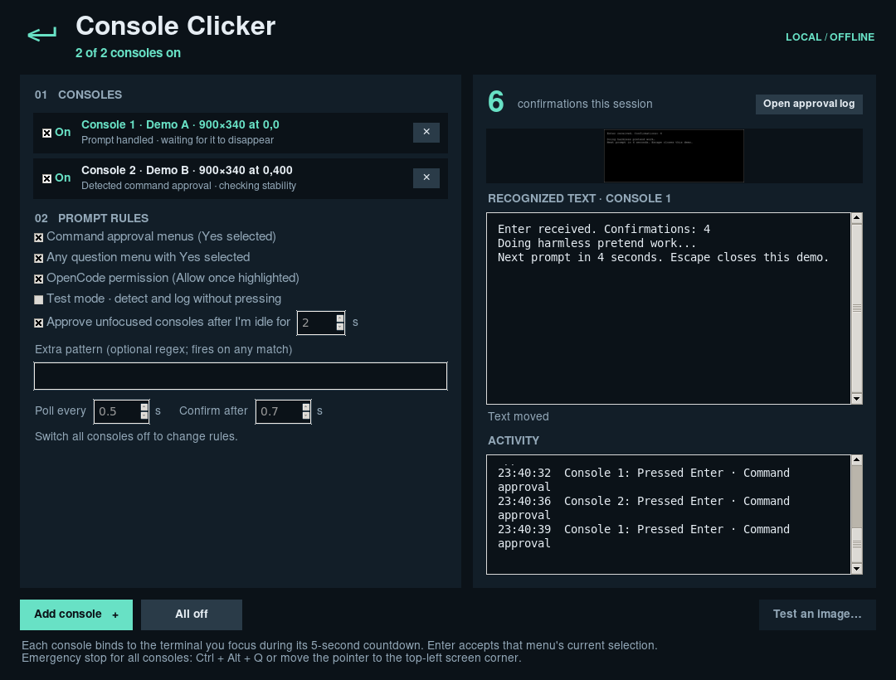

# Console Clicker

Presses Enter for the routine permission prompts AI coding CLIs keep asking,
in the terminals you choose, and logs every approval for later review.

Console Clicker is a desktop app for Linux (X11), Windows and macOS. It watches
one or more visible terminal areas, reads prompts offline with Tesseract OCR,
and presses Enter only when a menu's selected option is **Yes**, or, for
OpenCode, when **Allow once** is highlighted. Each terminal has its own on/off
switch, so you can let one agent run while you supervise another.



> [!WARNING]
> Console Clicker approves commands without you reading them, including
> destructive ones. Use it only with agents and projects where you would
> accept that risk. Start with **Test mode**, which detects and logs without
> pressing anything, and review the approval log regularly. If you want an
> agent to run fully unattended, its own settings (for example Claude Code
> permission allowlists, `opencode --auto`, or `codex --full-auto`) are more
> reliable than reading the screen.

**Status: experimental.** Tested on Linux X11 with the bundled demo, Claude
Code-style prompts rendered in xterm, and OpenCode 1.18.35. Windows, macOS, and
focus switching under full desktop window managers have not been tested yet.
Reports and fixes are welcome.

**Privacy.** Everything stays on your computer; the app makes no network
connections. It captures only the screen areas you select, and keeps those
images in memory. To know when you are idle, it notes the *time* of your last
keyboard or mouse input; it does not record which keys you press. The approval
log contains the recognized text of each approved prompt, which may include
anything visible in that terminal area. Delete or truncate it whenever you like.

Not affiliated with Anthropic, OpenCode, OpenAI or Google. Product names are
used only to describe compatibility.

## Use the application

Download the archive for your platform from the
[latest GitHub release](https://github.com/angsuman/console-clicker/releases/latest).

1. Open `ConsoleClicker.exe` on Windows, `ConsoleClicker` on Linux, or
   `ConsoleClicker.app` on macOS. Extract the entire distribution first;
   keep its supporting files together.
2. Click **Add console** and drag around a terminal's prompt area. Escape
   cancels. Then focus that terminal during the five-second countdown; the
   console binds to it and switches **On**.
3. Repeat for each terminal you want to watch. Each console row has an **On**
   switch: untick it to stop approving that terminal, tick it to resume (no
   countdown once bound). **✕** removes a console. **All off** stops every console.
4. Click a console row to see its screen preview and recognized text.
5. Keep the watched areas visible, not covered by other windows (including this
   app). Tile the terminals side by side.
6. Click **Open approval log** to review what was agreed to. Each entry has the
   time, console, window title, rule, and the recognized screen text, including
   the command that was approved. Test mode entries are marked
   “WOULD APPROVE (test mode)”.
7. Emergency stop for all consoles: **Ctrl+Alt+Q**, or move the pointer into the
   top-left screen corner. On macOS, Alt means Option.

The approval log is `~/.config/console-clicker/approvals.log` on Linux,
`%APPDATA%\console-clicker\approvals.log` on Windows, and
`~/Library/Application Support/console-clicker/approvals.log` on macOS. It is
append-only plain text; delete it whenever you like.

### What gets approved

Built-in rules fire only when all of these hold:

- the latest question on screen is followed by two or more numbered options;
- exactly one option line carries a menu cursor (`>`, `❯`, `›`, `●` and similar);
- that cursor line says **Yes**.

So a numbered list in an AI's reply (no cursor) is ignored, a menu whose cursor
you moved to “No” is left alone, and older menus above a newer question are
ignored. Box borders around a prompt are ignored. **Command approval menus**
require a question like “Run this command?”, “Do you want to proceed?” or “Allow
this action?”. **Any question menu with Yes selected** accepts any question.
Codex-style prompts with unnumbered options are not matched by the built-in
rules. If OCR misses the cursor, nothing is pressed.

**OpenCode permission** handles OpenCode's “△ Permission required / Allow once ·
Allow always · Reject” buttons, where the selection is shown only by a
highlighted background. The app finds the highlighted button, reads its label,
and presses Enter only when it is **Allow once**, never Allow always or Reject.
It works in the normal and `--mini` interfaces (checked with OpenCode 1.18.35 and
its default theme). OpenCode allows most tools without asking unless your config
sets `"permission"` rules to `"ask"`, for example `"permission": {"bash": "ask"}`.

The **Extra pattern** regular expression fires on any match, without the cursor/Yes
checks, for example `press\s+enter\s+to\s+continue`. Clear it to disable it.
**Test mode** detects and logs without pressing anything. Rules and timing lock
while any console is on; switch all off to change them.

### Focused and unfocused consoles

Keystrokes go to the focused window. A focused console is approved once you have
paused typing for a second. With **Approve unfocused consoles after I'm idle for
N s** enabled (default 5 s), a console you are not looking at is approved only
after you have not used the keyboard or mouse for N seconds. The app then:

1. switches focus to that terminal,
2. reads its area again and confirms the same prompt is really there,
3. checks you have not touched the keyboard or mouse meanwhile,
4. presses Enter, and switches focus back to the window you were using.

If any check fails, nothing is pressed and that console waits ten seconds before
trying again. Consoles take turns, so two never switch focus at once. With the
option off, unfocused consoles simply wait until you focus them. On macOS, apps
are activated as a whole rather than per window, so consoles there are approved
only while focused.

A recognized prompt must remain stable before Enter is sent. Each prompt is
identified by its question and the command above it. A different prompt that
replaces a handled one is answered at once; the same prompt is not answered
again until it has disappeared for at least one second. Presses on one console
are at least two seconds apart. Consoles and their bound windows last for the
session; preferences are saved locally. A console watches a fixed screen area:
after moving or resizing its terminal, remove the console and add it again. Desktop automation cannot make focus changes and key delivery
atomic; the checks above reduce, but do not eliminate, that race.

### Platform requirements

- **Windows:** Windows 10/11 desktop, 64-bit. The app uses the current foreground
  window; it cannot control a more privileged terminal from an ordinary process.
- **Linux:** X11 session, glibc 2.35 or newer for the provided Ubuntu 22.04 build.
  Wayland is not supported, and it is the default on recent Ubuntu and Fedora:
  choose “Ubuntu on Xorg” (or your desktop's X11 session) on the login screen.
  Native Wayland sessions are rejected with an explanatory message. A graphical display is needed; a headless shell cannot watch a screen.
- **macOS:** Grant Console Clicker **Screen Recording**, **Accessibility**, and
  **Input Monitoring** access in System Settings → Privacy & Security, then
  relaunch it. A source run may require granting access to Python/the terminal.
  Builds are separate for Intel and Apple Silicon and are unsigned. Signing and
  notarization are needed for ordinary public distribution. The foreground guard
  identifies the app and its front on-screen window via AppKit/Quartz.

## Run from source

Python 3.10+ with Tk is required. Packaged applications include Python, Tk,
Tesseract and its English language model; source runs need Tesseract installed.

```bash
python -m venv .venv
# Linux/macOS:
source .venv/bin/activate
# Windows PowerShell: .venv\Scripts\Activate.ps1
python -m pip install -r requirements.txt
python launcher.py
```

Install source-run OCR with `sudo apt install tesseract-ocr tesseract-ocr-eng
python3-tk` on Ubuntu, `brew install tesseract` on macOS, or a Windows Tesseract
installation with English data and its executable on PATH. The build workflow
uses conda-forge Tesseract on Windows. `CLICKER_TESSERACT` can point to a custom
executable. `CLICKER_TESSDATA` supplies a custom model directory for source runs
and builds. Packaged apps always use their bundled English model.

Run a harmless demo in another process, add it as a console, and focus it
during the countdown (run two demos to try several consoles):

```bash
python launcher.py --demo
```

The demo counts Enter presses and displays a new prompt every four seconds.
No shell commands are executed. The packaged executable also accepts `--demo`.

## Build executables

```bash
python -m pip install -r requirements-build.txt
python -m pytest -q
python scripts/build.py --archive
```

Run this on **each target OS** with Tesseract installed. The build bundles the
OCR executable, its native dependencies, and `eng.traineddata`. End users do
not need Python or Tesseract. PyInstaller requires separate native builds for
each platform; see its [platform build documentation](https://pyinstaller.org/en/stable/usage.html#supporting-multiple-operating-systems).

| Build host | Output | Archive |
| --- | --- | --- |
| Windows x64 | `dist/ConsoleClicker/ConsoleClicker.exe` | `ConsoleClicker-windows-amd64.zip` |
| Linux x64 | `dist/ConsoleClicker/ConsoleClicker` | `ConsoleClicker-linux-x86_64.tar.gz` |
| macOS | `dist/ConsoleClicker.app` | `ConsoleClicker-darwin-arm64.tar.gz` or `…-x86_64.tar.gz` |

The repository includes `.github/workflows/build.yml` to build and verify all
four targets on GitHub Actions. Push the project to your GitHub repository,
open **Actions → Build desktop executables → Run workflow**, and download its
artifacts. It also runs on main, version tags and pull requests. Version tags
publish a GitHub release with all four platform archives and SHA-256 checksums
after the builds, bundled OCR checks and Linux Docker smoke test succeed.

The source screenshot test runs without a desktop:

```bash
python launcher.py --check-image tests/fixtures/approval.png
dist/ConsoleClicker/ConsoleClicker --check-image tests/fixtures/approval.png
```

Exit status is 0 for a match, 2 for no match, and 1 for an OCR error. It never
sends a key. Tests cover prompt recognition, duplicate suppression, re-arming,
focus changes, background approval and its idle/visibility checks, the approval
log, stop during recognition, screen changes during OCR, and movement.
For graphical testing on each target, use `--demo` and verify the confirmation
counter, test mode, focus switching, and both emergency-stop methods.

### Test Linux in Docker

After building the Linux executable, run the packaged app in Ubuntu 22.04 with
a virtual X11 desktop. The runtime image has no system Python or Tesseract.
The test checks all five OCR fixtures, opens the app and demo, selects the demo
area, verifies an Enter confirmation and its approval log, and tests the
Ctrl+Alt+Q emergency stop.

```bash
docker build --target runtime-test -f scripts/docker/Dockerfile -t console-clicker-runtime-test .
docker run --rm --network none console-clicker-runtime-test
```

Run the source tests with dependencies installed from `requirements-build.txt`:

```bash
docker build --target source-test -f scripts/docker/Dockerfile -t console-clicker-source-test .
docker run --rm --network none console-clicker-source-test
```

These tests use the container's display and harmless demo. They cover Linux X11;
Windows, macOS, and behavior under other desktop window managers need native testing.

See [Tesseract documentation](https://tesseract-ocr.github.io/tessdoc/),
[Pillow screen capture](https://pillow.readthedocs.io/en/stable/reference/ImageGrab.html),
and [pynput platform limitations](https://pynput.readthedocs.io/en/latest/limitations.html).

MIT license for application source; see `THIRD_PARTY_NOTICES.md` for bundled
components.
